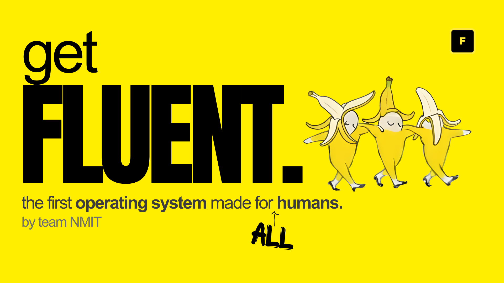
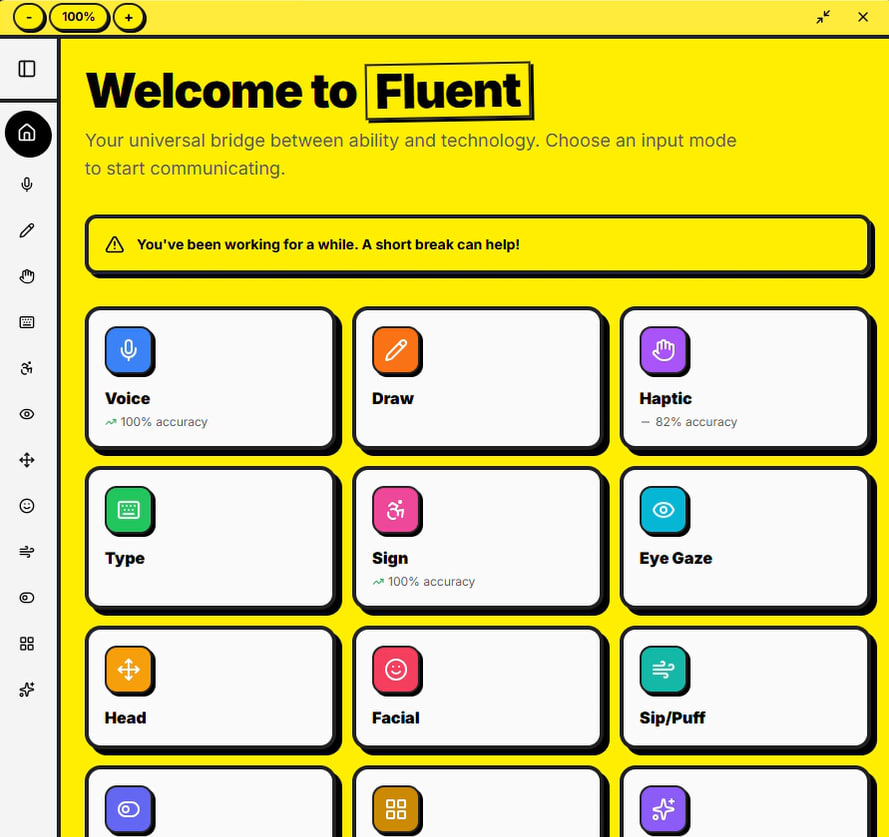
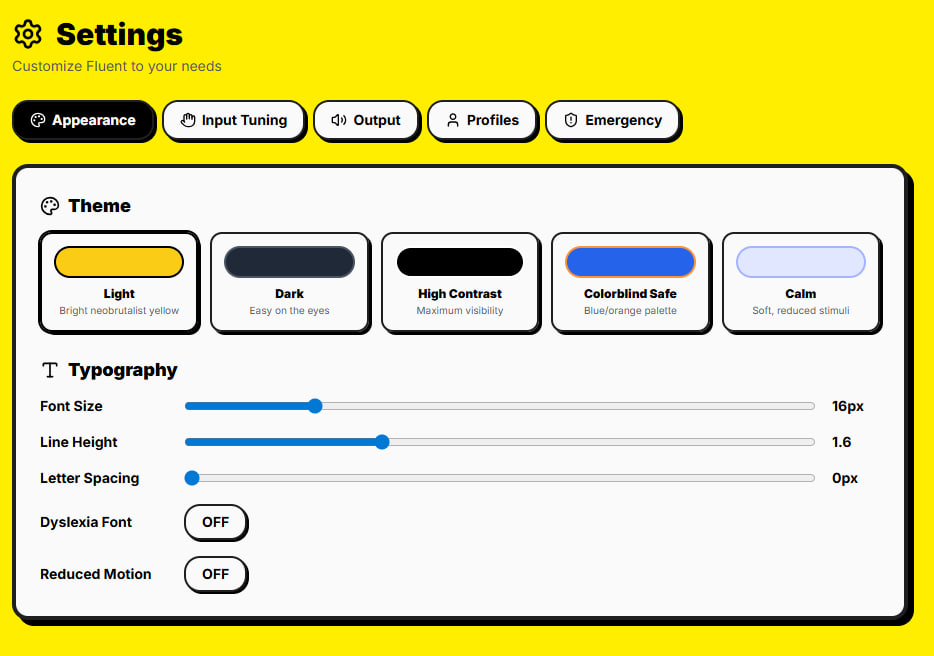

# Fluent - Universal Accessibility Input System



A privacy-first, Electron-based accessibility application that translates various input methods (voice, gestures, eye gaze, etc.) into natural language queries executed via an AI-powered desktop agent. It's cool to be accessible!

## Overview

### The Problem

Traditional computer interfaces assume everyone can use a mouse and keyboard. For millions of people with disabilities—whether from motor impairments, visual challenges, speech differences, or temporary injuries—this creates an insurmountable barrier to digital independence. Existing assistive technologies are often:

- **Fragmented**: Separate tools for each disability type
- **Expensive**: Enterprise solutions cost thousands of dollars
- **Privacy-invasive**: Cloud-based processing of sensitive health/usage data
- **One-size-fits-all**: Limited customization for individual needs
- **Difficult to learn**: Steep learning curves with poor onboarding

**The result?** People who need technology the most struggle to use it independently.

### The Solution

Fluent is a **universal accessibility platform** that empowers users to control their computer naturally, regardless of ability. It provides:

- **10 diverse input methods** in a single application
- **Privacy-first design** with all processing on your device
- **Intelligent automation** via vision-driven desktop agent
- **Beautiful, accessible UI** built with disability-first principles
- **Guided onboarding** that adapts to each user's unique needs
- **Free and open-source** for everyone

All inputs—whether voice, gestures, eye movements, or breath—are converted to natural language and executed through an AI-powered desktop agent that understands context and intent.

### Supported Input Methods

1. **Voice** - Speech transcription with accent/impediment support
2. **Draw/Gesture** - Custom gesture training and recognition
3. **Haptic** - Tap pattern recognition (short/long taps)
4. **Type** - Text refinement for assistive devices
5. **Sign Language** - Real-time sign recognition with custom gestures
6. **Eye Gaze** - Dwell-based interaction with calibration
7. **Head Motion** - Nod, shake, tilt detection with quantity support
8. **Facial Expression** - Smile, frown, blink, wink detection
9. **Sip/Puff** - Breath-based input with scanning
10. **Custom Input** - Create your own unique input methods

---

## 🌟 Accessibility at the Core

Fluent isn't just accessible—it's **built for accessibility first**. Every design decision prioritizes the needs of people with disabilities.

### Intelligent Onboarding Experience

The onboarding flow is **adaptive and empowering**, not patronizing:

1. **Profile Creation**
   - Choose your name and avatar
   - Select from colorful, personality-driven profile themes
   - No medical questionnaires or invasive questions

2. **Input Method Discovery**
   - Visual grid of all 10 input methods with clear icons
   - Select **only the methods that work for you**
   - No forced defaults—your choice, your way
   - Instant preview of each method before committing

3. **Personalized Tutorial**
   - Guided walkthrough of **only your selected inputs**
   - Interactive demos you can try immediately
   - Skip any step if you already understand it
   - **"Skip Onboarding" button** for power users or quick access

4. **Calibration for Precision**
   - Voice: Accent and speech pattern training
   - Eye Gaze: 9-point calibration for accurate tracking
   - Head Motion: Sensitivity adjustment based on range of motion
   - Custom sensitivity sliders for every input method

5. **Quick Start Option**
   - One-click "Guest" profile creation
   - Bypass onboarding entirely if needed
   - Jump straight to the dashboard with default settings
   - Perfect for emergency situations or first-time exploration

### Design Principles

#### 1. **Visual Accessibility**

**Neobrutalist Design Language**
- **Bold borders (3-4px)**: High-contrast edges make UI elements unmistakable
- **Thick shadows**: Depth perception without relying on subtle gradients
- **Zero rounded corners** (except buttons): Sharp, clear boundaries
- **Large touch targets**: Minimum 44×44px for all interactive elements
- **High color contrast**: WCAG AAA compliant in all themes

**Customizable Themes**
- **Light Mode**: Yellow/black neobrutalist (default)
- **Dark Mode**: Deep backgrounds for light sensitivity
- **High Contrast**: Pure black/white for maximum visibility
- **Colorblind Safe**: Blue/orange palette (no red/green)
- **Calm Mode**: Soft pastels for sensory sensitivities

**Typography Options**
- **OpenDyslexic font**: Specifically designed for dyslexia
- **Adjustable font size**: 12px - 32px in 2px increments
- **Letter spacing control**: 0px - 4px for reading comfort
- **Line height adjustment**: 1.2x - 2.0x for visual clarity

**Cursor Enhancements**
- **Large cursor option**: 2x size for visibility
- **Custom cursor colors**: Match your theme preferences
- **Focus indicators**: 3px outlines on all keyboard-navigable elements

#### 2. **Motor Accessibility**

**Tremor Filtering**
- Stabilization algorithms for hand tremors
- Smoothing for eye gaze jitter
- Debouncing for accidental taps
- Configurable dead zones

**Flexible Input Timing**
- Adjustable dwell times (400ms - 3000ms)
- Customizable tap thresholds (short vs. long)
- Pattern timeout controls
- Scanning speed adjustment (500ms - 3000ms intervals)

**Error Forgiveness**
- Undo/redo in output panel
- Easy gesture reset buttons
- Clear canvas/restart options
- Non-destructive actions

#### 3. **Cognitive Accessibility**

**Reduce Motion Option**
- Disables all animations when enabled
- Instant transitions instead of fades
- System-level reduced motion support
- Per-page animation controls

**Clear Information Hierarchy**
- Single-column layouts (no complex grids in docked mode)
- Progressive disclosure (help tooltips on demand)
- Consistent navigation patterns
- Visual status indicators (recording, processing, connected)

**Language Support**
- Voice input in 5+ languages (English, Spanish, Chinese, Malay, Tamil)
- Auto-detect language option
- Sign language support (ASL, BSL, custom)
- Simple, jargon-free interface text

#### 4. **Auditory Accessibility**

**Text-to-Speech Output**
- Built-in speech synthesis for all output
- Adjustable voice speed (0.5x - 2.0x)
- Customizable voice pitch
- Read-aloud on demand

**Visual Alternatives**
- All audio feedback has visual equivalents
- Waveform displays for microphone input
- Visual scanning indicators
- Status lights for recording states

#### 5. **Emergency & Safety Features**

**SOS Button**
- Always accessible in sidebar (bottom position)
- Global keyboard shortcut: **Ctrl/Cmd + Shift + S**
- Confirmation dialog prevents accidents
- Visual + haptic feedback when triggered
- Compact circular design in collapsed sidebar

**Predictable Behavior**
- No auto-play features
- Explicit start/stop controls
- Clear visual state indicators
- Confirmation for destructive actions

### Docked Mode for Assistive Use

**Always-On-Top Widget**
- 400×400px floating window
- Bottom-right corner positioning
- Stay focused while using other apps
- Drag to undock and restore full size
- Perfect for quick commands during work

**Collapsed Sidebar**
- Circular icon-only buttons
- Tooltips on hover for identification
- Perfect circles (no oval distortion)
- Center-aligned icons
- Accessible via Tab navigation

### Adaptive Learning Engine

Fluent learns from your usage patterns to improve over time:

- **Frequent phrases**: Quick access to commonly used commands
- **Input success rates**: Track which methods work best for you
- **Personalized suggestions**: "Try eye gaze—98% accuracy this week!"
- **Trend analysis**: "Voice input improving—great progress!"
- **Privacy-preserved**: All learning happens locally, no cloud sync

### Screen Reader Support

**Full ARIA Implementation**
- Semantic HTML5 structure
- `role` attributes on all interactive elements
- `aria-label` for icon-only buttons
- `aria-current` for navigation state
- `aria-live` regions for dynamic content
- Keyboard navigation with visible focus indicators

**Landmark Regions**
- Clear navigation structure
- Distinct main/aside/header sections
- Skip-to-content links
- Logical tab order

---

## Screenshots





---

## Architecture

```
┌─────────────────────────────────────────────────────────────┐
│                    Electron Frontend                         │
│  ┌─────────────┐  ┌─────────────┐  ┌─────────────┐         │
│  │   Browser   │  │  MediaPipe  │  │ TensorFlow  │         │
│  │   APIs      │  │  (client)   │  │  .js        │         │
│  └──────┬──────┘  └──────┬──────┘  └──────┬──────┘         │
│         │                │                │                  │
│         └────────────────┴────────────────┘                  │
│                          │                                    │
│                          ▼                                    │
│                  WebSocket Client                             │
└───────────────────────────┬──────────────────────────────────┘
                            │
                            │ WebSocket
                            │
┌───────────────────────────▼──────────────────────────────────┐
│                   FastAPI Backend                             │
│  ┌──────────────────────────────────────────────────────┐   │
│  │              Translation Modules                      │   │
│  │  Voice | Draw | Haptic | Sign | Eye | Head | etc.    │   │
│  └─────────────────────┬────────────────────────────────┘   │
│                        │                                      │
│                        ▼                                      │
│              Natural Language Query                           │
│                        │                                      │
│                        ▼                                      │
│              Desktop Agent Interface                          │
└────────────────────────┬─────────────────────────────────────┘
                         │
                         │
┌────────────────────────▼─────────────────────────────────────┐
│                  Desktop Agent (agent.py)                     │
│              Vision-based System Automation                   │
│                   (GPT-4o-mini/Gemini-2.5-flash)                          │
└───────────────────────────────────────────────────────────────┘
```

## Quick Start

**Want to get started right away?** See [QUICK_START.md](QUICK_START.md) for a 5-minute setup guide!

Or use the automated setup scripts:

```bash
# Windows
setup.bat
start-frontend.bat

# macOS/Linux
chmod +x setup.sh && ./setup.sh
chmod +x start-frontend.sh && ./start-frontend.sh
```

## Key Features

### Privacy First
- **Client-side processing**: Video/audio analyzed in browser
- **Local storage**: User data never leaves device
- **Minimal data transfer**: Only final natural language queries sent to backend

### Accessibility Focused
- **Tremor filtering**: Smoothing for motor impairments
- **Adjustable sensitivity**: Customize thresholds for each input
- **High contrast UI**: Neobrutalist design with clear visual feedback
- **Large touch targets**: Minimum 44px for all interactive elements
- **Screen reader support**: Full ARIA labels and semantic HTML

### Customizable
- **Custom gestures**: Train personalized gestures for any input method
- **Calibration**: Per-user calibration for eye gaze, head tracking, voice
- **Pattern library**: Define custom haptic patterns, expressions, head motions
- **Adaptive learning**: System learns from usage patterns

## Installation

### Prerequisites

#### Required Software

| Software | Minimum Version | Recommended | Download |
|----------|----------------|-------------|----------|
| **Node.js** | 18.17.0 | 20.x LTS | [nodejs.org](https://nodejs.org/) |
| **npm** | 9.0.0 | 10.x | Comes with Node.js |
| **Python** | 3.9 | 3.11 | [python.org](https://www.python.org/) |
| **pip** | 21.0 | Latest | Comes with Python |
| **Git** | 2.30.0 | Latest | [git-scm.com](https://git-scm.com/) |

#### System Requirements

- **OS**: Windows 10+, macOS 11+, or Ubuntu 20.04+
- **RAM**: 4GB minimum, 8GB recommended
- **Storage**: 1GB free space
- **Camera**: Required for eye gaze, sign language, facial expression, head motion
- **Microphone**: Required for voice and sip/puff input

#### API Keys

You'll need a **Google Gemini API Key** for AI-powered features:

1. Visit [Google AI Studio](https://aistudio.google.com/app/apikey)
2. Sign in with your Google account
3. Click "Create API Key"
4. Copy your API key (keep it secure!)

### Quick Setup

```bash
# 1. Clone the repository
git clone https://github.com/jasonmatthewsuhari/ntu-beyond-binary.git
cd ntu-beyond-binary

# 2. Install dependencies
npm install                    # Root dependencies
cd frontend && npm install     # Frontend dependencies
cd ../backend && pip install -r requirements.txt  # Backend dependencies

# 3. Configure environment
cd backend
echo "GOOGLE_API_KEY=your_api_key_here" > .env

# 4. Run the application (from root directory)
# Windows:
.\run.bat

# macOS/Linux:
chmod +x run.sh
./run.sh
```

### Detailed Setup Guide

#### Step 1: Clone the Repository

```bash
git clone https://github.com/jasonmatthewsuhari/ntu-beyond-binary.git
cd ntu-beyond-binary
```

#### Step 2: Install Backend Dependencies

##### Windows

```powershell
# Navigate to backend directory
cd backend

# Create virtual environment (recommended)
python -m venv venv
.\venv\Scripts\activate

# Install dependencies
pip install -r requirements.txt

# Verify installation
python -c "import fastapi, uvicorn, mediapipe; print('Backend ready!')"
```

##### macOS/Linux

```bash
# Navigate to backend directory
cd backend

# Create virtual environment (recommended)
python3 -m venv venv
source venv/bin/activate

# Install dependencies
pip install -r requirements.txt

# Verify installation
python -c "import fastapi, uvicorn, mediapipe; print('Backend ready!')"
```

**Common Issues:**
- **TensorFlow installation fails**: Ensure you have Python 3.9-3.11 (TensorFlow doesn't support 3.12+)
- **MediaPipe fails on ARM Macs**: Install Rosetta 2: `softwareupdate --install-rosetta`
- **OpenCV issues**: May need to install system dependencies:
  - Ubuntu: `sudo apt-get install libgl1-mesa-glx`
  - macOS: `brew install opencv`

#### Step 3: Install Frontend Dependencies

```bash
# Navigate to frontend directory (from root)
cd frontend

# Install dependencies
npm install

# Verify installation
npm run dev -- --help
```

**Common Issues:**
- **npm install fails**: Clear cache with `npm cache clean --force`
- **Electron errors**: Rebuild: `npm rebuild electron`
- **Permission errors (Linux/Mac)**: Don't use `sudo`, fix npm permissions

#### Step 4: Environment Configuration

Create a `.env` file in the `backend` directory:

**Windows (PowerShell):**
```powershell
cd backend
@"
GOOGLE_API_KEY=your_gemini_api_key_here
"@ | Out-File -FilePath .env -Encoding utf8
```

**macOS/Linux:**
```bash
cd backend
cat > .env << EOF
GOOGLE_API_KEY=your_gemini_api_key_here
EOF
```

**Manual Setup:**
1. Copy the example file: `cp backend/env.example backend/.env`
2. Edit `backend/.env` and replace the placeholder with your actual API key:
   ```
   GOOGLE_API_KEY=your_actual_api_key_here
   ```
3. Save the file

**Note:** The `.env` file is gitignored to prevent accidentally committing your API key.

#### Step 5: Run the Application

##### Development Mode

**Option 1: Automated (Recommended)**

```bash
# Windows
cd frontend
npm run electron-dev

# macOS/Linux
cd frontend
npm run electron-dev
```

This automatically starts:
- Backend server (http://localhost:8000)
- Next.js dev server (http://localhost:3001)
- Electron window

**Option 2: Manual (3 terminals)**

```bash
# Terminal 1 - Backend Server
cd backend
# Activate venv if you created one
# Windows: .\venv\Scripts\activate
# macOS/Linux: source venv/bin/activate
python src/server.py
# Server runs on http://127.0.0.1:8000

# Terminal 2 - Frontend Dev Server
cd frontend
npm run dev
# Server runs on http://localhost:3001

# Terminal 3 - Electron App
cd frontend
npm run electron
```

##### Production Mode - Simple Build

```bash
# Build and package the application (frontend only)
cd frontend
npm run build
npm run electron-build

# Executable will be in frontend/dist/
# Windows: Fluent-Setup-1.0.0.exe
# macOS: Fluent-1.0.0.dmg
# Linux: Fluent-1.0.0.AppImage

# Note: This requires Python to be installed on user's machine
```

##### Production Mode - Standalone Build (Recommended)

For a **completely standalone executable** that includes everything (no Python needed!):

```bash
# Build everything with bundled backend
# Windows:
build-all.bat

# macOS/Linux:
chmod +x build-all.sh
./build-all.sh

# Creates a complete installer with:
# ✅ Python backend bundled inside
# ✅ All dependencies included
# ✅ Users just download and run!
```

See [BUILD_INSTRUCTIONS.md](BUILD_INSTRUCTIONS.md) for detailed build documentation.

### Verification

After setup, verify everything works:

1. **Backend Health Check:**
   ```bash
   curl http://localhost:8000/health
   # Should return: {"status":"ok"}
   ```

2. **Frontend Access:**
   - Open browser to http://localhost:3001
   - Should see Fluent dashboard

3. **Electron Launch:**
   - Window should open automatically
   - Check console for errors (Help > Toggle Developer Tools)

4. **WebSocket Connection:**
   - Click any input method (e.g., Voice)
   - Bottom right should show "Connected"
   - If "Disconnected", check backend is running

### Updating

```bash
# Pull latest changes
git pull origin main

# Update backend dependencies
cd backend
pip install -r requirements.txt --upgrade

# Update frontend dependencies
cd ../frontend
npm install

# Rebuild Electron
npm run electron-build
```

## Usage

### Getting Started

1. **Launch Fluent** - The Electron app will start the backend automatically
2. **Select Input Method** - Choose from the dashboard
3. **Calibrate** (if needed) - Eye gaze, head tracking, and voice benefit from calibration
4. **Start Using** - Speak, gesture, or use any input method
5. **Natural Language** - All inputs convert to queries like "Open calculator"
6. **Execute** - Desktop agent performs the action

### Example Workflows

**Voice:**
1. Click microphone button
2. Say "Open my email"
3. System transcribes and executes

**Sign Language:**
1. Enable camera
2. Sign words (e.g., "I NEED HELP")
3. System buffers signs, sends to LLM
4. LLM interprets intent, executes action

**Eye Gaze:**
1. Complete 9-point calibration
2. Look at screen regions
3. Dwell on target to select
4. Execute mapped actions

**Custom Gestures (Draw):**
1. Draw gesture 5 times
2. Assign meaning (e.g., "Check calendar")
3. Use gesture to trigger action

## Troubleshooting

### Common Issues

#### Backend Won't Start

**Problem:** `ModuleNotFoundError` or import errors

**Solutions:**
```bash
# Reinstall dependencies
cd backend
pip install -r requirements.txt --force-reinstall

# Check Python version
python --version  # Should be 3.9-3.11

# Activate virtual environment (if using)
# Windows: .\venv\Scripts\activate
# macOS/Linux: source venv/bin/activate
```

**Problem:** Port 8000 already in use

**Solutions:**
```bash
# Windows - Find process using port 8000
netstat -ano | findstr :8000
taskkill /PID <PID> /F

# macOS/Linux
lsof -ti:8000 | xargs kill -9

# Or change port in backend/src/server.py
uvicorn.run(app, host="127.0.0.1", port=8001)  # Use 8001 instead
```

#### Frontend Issues

**Problem:** `npm install` fails with permission errors

**Solutions:**
```bash
# Clear npm cache
npm cache clean --force

# Don't use sudo! Fix npm permissions instead:
# https://docs.npmjs.com/resolving-eacces-permissions-errors

# Or use nvm (Node Version Manager)
```

**Problem:** Electron window won't open

**Solutions:**
```bash
cd frontend

# Rebuild Electron
npm rebuild electron

# Clear cache
rm -rf node_modules/.cache
rm -rf out/

# Reinstall
npm install
```

**Problem:** "WebSocket connection failed"

**Solutions:**
1. Verify backend is running: `curl http://localhost:8000/health`
2. Check firewall isn't blocking port 8000
3. Ensure WebSocket URL is correct in frontend code
4. Check browser console for detailed error

#### Camera/Microphone Access

**Problem:** Browser won't allow camera access

**Solutions:**
- **Chrome/Edge:** Go to `chrome://settings/content/camera` and allow
- **Firefox:** Go to `about:preferences#privacy` → Permissions
- **Electron:** Camera permissions are automatically requested
- **macOS:** System Preferences → Security & Privacy → Camera/Microphone

**Problem:** MediaPipe fails to initialize

**Solutions:**
```bash
# Verify MediaPipe is installed
python -c "import mediapipe; print(mediapipe.__version__)"

# Reinstall if needed
pip uninstall mediapipe
pip install mediapipe==0.10.9

# Check camera is detected
# macOS/Linux
ls /dev/video*

# Windows (PowerShell)
Get-PnpDevice -Class Camera
```

#### Desktop Agent Issues

**Problem:** "Agent not responding" or query execution fails

**Solutions:**
1. **Check API Key:**
   ```bash
   cd backend
   cat .env  # Should show GOOGLE_API_KEY=...
   ```

2. **Verify agent.py exists:**
   ```bash
   ls agent.py  # Should be in root directory
   ```

3. **Test agent directly:**
   ```bash
   python agent.py
   # Should initialize without errors
   ```

4. **Check API quota:**
   - Visit [Google AI Studio](https://aistudio.google.com/)
   - Verify you haven't exceeded rate limits

**Problem:** "GOOGLE_API_KEY not found"

**Solutions:**
```bash
# Verify .env file exists
cd backend
ls -la .env  # Should show .env file

# Check contents
cat .env

# Recreate if missing
echo "GOOGLE_API_KEY=your_key_here" > .env

# Restart backend server
```

#### Performance Issues

**Problem:** High CPU usage

**Solutions:**
- Lower camera resolution in input settings
- Disable input methods you're not using
- Close other applications
- Check for memory leaks in browser DevTools

**Problem:** Lag or delayed responses

**Solutions:**
1. Check network latency: `ping localhost`
2. Reduce MediaPipe model complexity
3. Disable tremor filtering if not needed
4. Use faster computer or close background apps

#### Platform-Specific

**macOS - Apple Silicon (M1/M2/M3)**
```bash
# Install Rosetta 2 for compatibility
softwareupdate --install-rosetta

# Use Python x86_64 version for better compatibility
arch -x86_64 /usr/local/bin/python3 -m venv venv
```

**Linux - Missing Dependencies**
```bash
# Ubuntu/Debian
sudo apt-get update
sudo apt-get install -y \
  python3-pip \
  python3-venv \
  libgl1-mesa-glx \
  libglib2.0-0 \
  libsm6 \
  libxext6 \
  libxrender-dev

# Fedora/RHEL
sudo dnf install -y \
  python3-pip \
  mesa-libGL \
  glib2
```

**Windows - Microsoft Visual C++ Error**
```powershell
# TensorFlow requires Visual C++ Redistributable
# Download from:
# https://aka.ms/vs/17/release/vc_redist.x64.exe
```

### Getting Help

If you're still stuck:

1. **Check logs:**
   - Backend: Console output where `python src/server.py` is running
   - Frontend: Browser console (F12) or Electron DevTools
   - Electron: `frontend/out/dev/logs/next-development.log`

2. **Enable debug mode:**
   ```bash
   # Backend
   export DEBUG=1  # Linux/Mac
   set DEBUG=1     # Windows
   python src/server.py

   # Frontend - check console for detailed errors
   ```

3. **Create an issue:**
   - Visit GitHub Issues
   - Include: OS version, Python version, Node version, error logs
   - Describe steps to reproduce

## Configuration

### User Profiles

Profiles store:
- Calibration data
- Custom gestures
- Settings preferences
- Usage statistics

Located in: `backend/data/profiles/{profile_id}.json`

### Calibration Data

Calibration for:
- Eye gaze (9-point transformation matrix)
- Voice (accent, impediments, common phrases)
- Sip/puff (breath characteristics)

Located in: `backend/data/calibrations/{profile_id}/{method}.json`

### Custom Gestures

Custom gestures store:
- Training samples
- Trained models (KNN, small neural nets)
- Query mappings

Located in: `backend/data/gestures/{profile_id}/`

### Advanced Configuration

#### Backend Settings

Edit `backend/src/server.py` to configure:

```python
# Server host and port
BACKEND_HOST = "127.0.0.1"
BACKEND_PORT = 8000

# CORS settings (for web browser access)
CORS_ORIGINS = ["http://localhost:3001", "http://localhost:3000"]

# WebSocket ping interval
WS_PING_INTERVAL = 30  # seconds

# Desktop agent timeout
AGENT_TIMEOUT = 120  # seconds
```

#### Frontend Settings

Edit `frontend/lib/constants.ts`:

```typescript
// WebSocket connection
export const WS_URL = "ws://127.0.0.1:8000/ws"

// Camera settings
export const CAMERA_WIDTH = 1280
export const CAMERA_HEIGHT = 720
export const CAMERA_FPS = 30

// MediaPipe confidence thresholds
export const MIN_DETECTION_CONFIDENCE = 0.5
export const MIN_TRACKING_CONFIDENCE = 0.5
```

#### Accessibility Settings

Each input method can be customized in Settings:

- **Tremor Filtering**: Smoothing factor (0-1)
- **Sensitivity**: Detection threshold
- **Timing**: Dwell time, debounce delay
- **Visual Feedback**: Size, color, position
- **Audio Cues**: Enable/disable sound feedback

### Data Management

#### Backup User Data

```bash
# Backup all user data
cd backend
tar -czf backup-$(date +%Y%m%d).tar.gz data/

# Or use the built-in export feature in Settings
```

#### Reset to Defaults

```bash
# Delete all user data (WARNING: Cannot be undone!)
cd backend
rm -rf data/

# App will recreate folders on next launch
```

#### Export/Import Profiles

Use the Settings page in the app:
1. Settings → Profiles
2. Select profile
3. Export → Save JSON file
4. To import: Settings → Import Profile → Select JSON file

## Testing

### Manual Testing

#### Test Individual Input Methods

```bash
# Test voice transcription
cd backend/src/translate/voice
python take_voice_input.py test_audio.wav

# Test haptic patterns
cd backend/src/translate/haptic
python take_haptic_input.py "S-S-L"

# Test sign language recognition
cd backend/src/translate/sign
python live_sign_demo.py

# Test desktop agent
cd ../../..  # Back to root
python agent.py
```

#### Test WebSocket Connections

```bash
# Start backend
cd backend
python src/server.py

# In another terminal, test WebSocket
# Using wscat (install: npm install -g wscat)
wscat -c ws://localhost:8000/ws/voice/test-client-123

# Send test message:
{"type": "ping", "timestamp": "2026-02-11T12:00:00.000Z"}
```

#### Test API Endpoints

```bash
# Health check
curl http://localhost:8000/health

# List profiles
curl http://localhost:8000/api/profiles

# Agent status
curl http://localhost:8000/api/agent/status

# Execute query (requires agent.py running)
curl -X POST http://localhost:8000/api/execute \
  -H "Content-Type: application/json" \
  -d '{"query": "What time is it?"}'
```

### Frontend Testing

```bash
cd frontend

# Run Next.js development server
npm run dev

# Open in browser
open http://localhost:3001

# Test pages:
# - http://localhost:3001 (Dashboard)
# - http://localhost:3001/input/voice
# - http://localhost:3001/input/sign
# - http://localhost:3001/settings
```

### Accessibility Testing

Use these tools to verify accessibility:

1. **Chrome DevTools Lighthouse:**
   - Open DevTools (F12)
   - Lighthouse tab → Accessibility audit
   - Should score 90+

2. **Screen Reader Testing:**
   - **Windows:** Enable Narrator (Win + Ctrl + Enter)
   - **macOS:** Enable VoiceOver (Cmd + F5)
   - **Linux:** Enable Orca

3. **Keyboard Navigation:**
   - Test Tab, Enter, Escape keys
   - All features should be accessible without mouse

4. **Contrast Checker:**
   - Use [WebAIM Contrast Checker](https://webaim.org/resources/contrastchecker/)
   - All text should meet WCAG AA standards

## Development

### Project Structure

```
.
├── frontend/               # Electron + Next.js app
│   ├── app/               # Next.js pages (App Router)
│   │   ├── page.tsx       # Dashboard
│   │   ├── input/         # Input method pages
│   │   ├── settings/      # Settings page
│   │   ├── onboarding/    # Onboarding flow
│   │   └── profile-select/ # Profile selection
│   ├── components/        # React components
│   │   ├── app-shell.tsx  # Main layout
│   │   ├── output-panel.tsx # AI response display
│   │   ├── sos-button.tsx # Emergency SOS
│   │   └── ui/            # shadcn/ui components
│   ├── lib/               # Utilities & WebSocket client
│   ├── electron/          # Electron main process
│   │   ├── main.js        # Main process
│   │   └── preload.js     # Preload script
│   ├── public/            # Static assets
│   └── package.json       # Dependencies & scripts
│
├── backend/               # Python FastAPI backend
│   ├── src/
│   │   ├── server.py      # FastAPI WebSocket server
│   │   ├── agent_interface.py # Desktop agent integration
│   │   ├── storage/       # Data persistence layer
│   │   │   ├── profiles.py
│   │   │   ├── calibrations.py
│   │   │   └── gestures.py
│   │   └── translate/     # Input translation modules
│   │       ├── voice/     # Speech-to-text
│   │       ├── draw/      # Gesture recognition
│   │       ├── haptic/    # Tap patterns
│   │       ├── sign/      # Sign language ASL/BSL
│   │       ├── eye_gaze/  # Eye tracking
│   │       ├── head/      # Head motion
│   │       ├── facial/    # Facial expressions
│   │       ├── sip_puff/  # Breath detection
│   │       └── text/      # Text refinement
│   ├── data/              # User data (gitignored)
│   │   ├── profiles/
│   │   ├── calibrations/
│   │   └── gestures/
│   ├── requirements.txt   # Python dependencies
│   ├── start_server.bat   # Windows startup script
│   └── start_server.sh    # Unix startup script
│
├── agent.py               # Desktop automation agent
├── desktop_agent.py       # Agent implementation (Gemini)
├── package.json           # Root dependencies
└── README.md              # This file
```

### Development Workflow

1. **Start Backend in Dev Mode:**
   ```bash
   cd backend
   # Activate venv if using
   python src/server.py
   # Auto-reloads on file changes
   ```

2. **Start Frontend in Dev Mode:**
   ```bash
   cd frontend
   npm run dev
   # Next.js dev server with hot reload
   ```

3. **Run Electron:**
   ```bash
   cd frontend
   npm run electron
   # Or use npm run electron-dev for auto-start
   ```

4. **Make Changes:**
   - Frontend: Edit files in `frontend/app/` or `frontend/components/`
   - Backend: Edit files in `backend/src/`
   - Changes auto-reload in dev mode

5. **Test Changes:**
   - Use browser DevTools (F12)
   - Check console for errors
   - Test with actual input devices

### Adding a New Input Method

Follow these steps to add a new input method (e.g., "Gesture"):

#### 1. Backend Module

Create `backend/src/translate/gesture/`:

```python
# backend/src/translate/gesture/__init__.py
def translate_gesture(data: dict) -> str:
    """
    Translate gesture data to natural language query.
    
    Args:
        data: Dict containing gesture information
        
    Returns:
        Natural language query string
    """
    # Your translation logic here
    return "Open calculator"

# backend/src/translate/gesture/take_gesture_input.py
def process_gesture_stream(gesture_stream):
    """Process real-time gesture data"""
    # Implementation here
    pass
```

Add WebSocket handler to `backend/src/server.py`:

```python
@app.websocket("/ws/gesture/{client_id}")
async def websocket_gesture(websocket: WebSocket, client_id: str):
    await manager.connect(websocket, client_id)
    try:
        while True:
            data = await websocket.receive_json()
            if data["type"] == "gesture_data":
                from translate.gesture import translate_gesture
                query = translate_gesture(data["gesture"])
                # Send to desktop agent...
    except WebSocketDisconnect:
        manager.disconnect(client_id)
```

#### 2. Frontend Page

Create `frontend/app/input/gesture/page.tsx`:

```typescript
'use client'

import { useState, useEffect } from 'react'
import { ModePageLayout } from '@/components/mode-page-layout'

export default function GesturePage() {
  const [ws, setWs] = useState<WebSocket | null>(null)
  const [connected, setConnected] = useState(false)

  useEffect(() => {
    const websocket = new WebSocket(
      `ws://localhost:8000/ws/gesture/${Date.now()}`
    )
    
    websocket.onopen = () => setConnected(true)
    websocket.onclose = () => setConnected(false)
    
    setWs(websocket)
    return () => websocket.close()
  }, [])

  const sendGesture = (gesture: any) => {
    if (ws && connected) {
      ws.send(JSON.stringify({
        type: 'gesture_data',
        gesture: gesture,
        timestamp: new Date().toISOString()
      }))
    }
  }

  return (
    <ModePageLayout
      title="Gesture Input"
      description="Use hand gestures to control your computer"
    >
      {/* Your UI here */}
    </ModePageLayout>
  )
}
```

#### 3. Update Navigation

Add to `frontend/components/app-shell.tsx`:

```typescript
const INPUT_MODES = [
  // ... existing modes ...
  {
    id: 'gesture',
    name: 'Gesture',
    icon: Hand,
    path: '/input/gesture',
    description: 'Hand gesture recognition',
  },
]
```

#### 4. Add Icon and Styling

- Add icon to `frontend/components/ui/icons.tsx` if needed
- Style using Tailwind classes
- Ensure WCAG AA contrast ratios

#### 5. Test

```bash
# Test backend module
cd backend/src/translate/gesture
python take_gesture_input.py

# Test WebSocket connection
# Start backend, then test in browser console:
const ws = new WebSocket('ws://localhost:8000/ws/gesture/test')
ws.onmessage = (e) => console.log(e.data)

# Test frontend page
# Navigate to http://localhost:3001/input/gesture
```

### Code Style Guidelines

#### Python (Backend)

```python
# Use type hints
def process_input(data: dict) -> str:
    pass

# Docstrings for all functions
def calibrate(points: list[tuple]) -> np.ndarray:
    """
    Calibrate eye gaze using control points.
    
    Args:
        points: List of (screen_x, screen_y, gaze_x, gaze_y) tuples
        
    Returns:
        Transformation matrix (3x3 numpy array)
    """
    pass

# Follow PEP 8
# Use Black formatter: pip install black
# Format: black backend/src/
```

#### TypeScript (Frontend)

```typescript
// Use TypeScript for all files
interface GestureData {
  type: string
  timestamp: string
  confidence: number
}

// Functional components with TypeScript
const Component: React.FC<Props> = ({ prop1, prop2 }) => {
  return <div>...</div>
}

// Use Prettier formatter
// Format: npm run format (if configured)
```

### Git Workflow

```bash
# Create feature branch
git checkout -b feature/new-input-method

# Make changes and commit
git add .
git commit -m "feat: Add gesture input method"

# Push and create PR
git push origin feature/new-input-method

# Commit message format:
# feat: New feature
# fix: Bug fix
# docs: Documentation
# style: Formatting
# refactor: Code restructuring
# test: Tests
# chore: Maintenance
```

## Accessibility Checklist

Every input method must:
- ✅ Support tremor filtering/smoothing
- ✅ Adjustable timing/sensitivity
- ✅ Large touch targets (≥44px)
- ✅ High contrast visual feedback
- ✅ ARIA labels and semantic HTML
- ✅ Keyboard navigation support
- ✅ Screen reader announcements
- ✅ Clear error messages
- ✅ Help documentation
- ✅ Practice/calibration mode

## Technologies

- **Frontend**: Next.js 15, React 19, TypeScript, TailwindCSS
- **Desktop**: Electron
- **Backend**: FastAPI, WebSockets, Python
- **ML**: TensorFlow, scikit-learn, MediaPipe
- **Vision**: OpenCV, MediaPipe (Hands, Face Mesh)
- **AI**: Google Gemini 2.5 Flash
- **Storage**: File-based JSON

## Performance Targets

- **Latency**: <500ms input to feedback
- **Accuracy**: >85% recognition per method
- **Reliability**: <1% connection failures
- **Calibration**: <5 minutes per method

## FAQ

### General Questions

**Q: Is Fluent free to use?**  
A: Yes, Fluent is open-source and free. You only need a free Google Gemini API key.

**Q: Does Fluent work offline?**  
A: Partially. Client-side processing (camera, microphone) works offline, but the desktop agent requires internet for Gemini API calls.

**Q: What platforms are supported?**  
A: Windows 10+, macOS 11+, and Linux (Ubuntu 20.04+, Fedora, etc.)

**Q: Is my data private?**  
A: Yes! All video/audio processing happens on your device. Only final natural language queries are sent to the Gemini API.

**Q: Can I use multiple input methods at once?**  
A: Not simultaneously, but you can quickly switch between methods from the dashboard.

### Setup Questions

**Q: I don't have a Google API key. How do I get one?**  
A: Visit [Google AI Studio](https://aistudio.google.com/app/apikey), sign in, and click "Create API Key". It's free!

**Q: Do I need a powerful computer?**  
A: Recommended: 8GB RAM, modern CPU. Some methods (eye gaze, sign language) benefit from a GPU but don't require one.

**Q: Can I use my phone's camera?**  
A: Not directly, but you can use apps like DroidCam or iVCam to use your phone as a webcam.

**Q: Python 3.12 isn't working. What should I do?**  
A: TensorFlow doesn't support Python 3.12 yet. Please use Python 3.9, 3.10, or 3.11.

### Usage Questions

**Q: How accurate is sign language recognition?**  
A: Varies by lighting, camera quality, and signing speed. Expect 75-90% accuracy with good conditions and custom sign training.

**Q: Can Fluent understand my accent?**  
A: Yes! Voice calibration mode helps the system learn your speech patterns. Gemini also handles many accents well.

**Q: What happens in an emergency?**  
A: The red SOS button (bottom right) immediately triggers emergency services contact. Customize in Settings.

**Q: Can I create custom gestures?**  
A: Yes! Use the Draw or Sign Language input methods to train custom gestures mapped to specific commands.

**Q: How long does calibration take?**  
A: Eye gaze: ~2 minutes, Voice: ~3 minutes, Sip/Puff: ~1 minute, Others: optional or not needed.

### Technical Questions

**Q: Why WebSockets instead of REST API?**  
A: WebSockets provide real-time bidirectional communication needed for streaming input (voice, video) and instant feedback.

**Q: Can I use a different AI model instead of Gemini?**  
A: Yes! Edit `agent.py` to use OpenAI, Anthropic, or local models. Gemini is used for its vision capabilities.

**Q: How do I add support for my language?**  
A: Gemini supports 100+ languages. For sign language, you can add custom signs using the training feature.

**Q: Can I run the backend on a different machine?**  
A: Yes! Update the WebSocket URL in `frontend/lib/constants.ts` to point to your backend server.

**Q: Is there a CLI version?**  
A: Not currently, but you can use the backend API directly. See `backend/README.md` for API documentation.

### Accessibility Questions

**Q: I have tremors. Will this work for me?**  
A: Yes! All input methods have tremor filtering/smoothing options in Settings. Adjust sensitivity to your needs.

**Q: I can't use a mouse. Can I navigate with keyboard only?**  
A: Yes! All features support keyboard navigation (Tab, Enter, Escape). See Settings for keyboard shortcuts.

**Q: Does it work with screen readers?**  
A: Yes! Full ARIA labels and semantic HTML for NVDA, JAWS, Narrator, VoiceOver, and Orca.

**Q: I have limited mobility. Which input method is best?**  
A: Depends on your abilities:
- **Eye gaze**: If you can control eye movement
- **Voice**: If you can speak clearly
- **Sip/Puff**: If you can control breathing
- **Facial expressions**: If you have facial muscle control
- **Head motion**: If you can move your head

**Q: Can I use switch controls?**  
A: Yes! The haptic input method supports single-switch and dual-switch scanning.

### Troubleshooting Questions

**Q: Camera not working in Electron**  
A: Check System Settings → Privacy → Camera and allow Fluent. On macOS, may need to grant permission in System Preferences.

**Q: Voice input not transcribing**  
A: 1) Check microphone permissions, 2) Verify GOOGLE_API_KEY is set, 3) Test with System Settings → Sound → Input

**Q: High CPU usage**  
A: Lower camera resolution in Settings, close other apps, or disable input methods you're not using.

**Q: WebSocket keeps disconnecting**  
A: 1) Check backend is running, 2) Verify firewall settings, 3) Check network stability, 4) Try increasing WS_PING_INTERVAL

**Q: "Agent not responding" error**  
A: 1) Verify API key is correct, 2) Check internet connection, 3) Confirm agent.py is in root directory, 4) Check API rate limits

## Contributing

We welcome contributions! Here's how to get involved:

### Ways to Contribute

1. **Report Bugs**: Open an issue with details, steps to reproduce, and your environment
2. **Suggest Features**: Describe your idea and how it helps accessibility
3. **Improve Documentation**: Fix typos, clarify instructions, add examples
4. **Add Input Methods**: Contribute new ways to interact with computers
5. **Test Accessibility**: Try with real assistive devices and report findings
6. **Translate**: Help translate the UI to other languages

### Contribution Guidelines

1. **Fork the repository**
   ```bash
   git clone https://github.com/jasonmatthewsuhari/ntu-beyond-binary.git
   ```

2. **Create a feature branch**
   ```bash
   git checkout -b feature/amazing-feature
   ```

3. **Make your changes**
   - Follow code style guidelines (see Development section)
   - Add comments explaining complex logic
   - Update documentation if needed

4. **Test thoroughly**
   - Test with actual input devices
   - Verify accessibility (keyboard nav, screen readers)
   - Run existing tests: `npm test` / `pytest`

5. **Commit with clear messages**
   ```bash
   git commit -m "feat: Add braille display support"
   ```

6. **Push and create Pull Request**
   ```bash
   git push origin feature/amazing-feature
   ```

7. **Respond to review feedback**

### Code of Conduct

- Be respectful and inclusive
- Prioritize accessibility in all changes
- Test with real users when possible
- Assume positive intent
- Help others learn and grow

### Testing with Real Users

When possible, test your changes with people who have disabilities. Consider:
- Various levels of motor control
- Visual impairments
- Hearing impairments  
- Cognitive differences
- Different assistive technologies

## Roadmap

### In Progress
- [ ] Braille display output support
- [ ] Multi-language UI translations
- [ ] Offline mode for desktop agent
- [ ] Mobile companion app

### Planned Features
- [ ] Brain-computer interface (BCI) support
- [ ] Predictive text for faster input
- [ ] Gesture macros and workflows
- [ ] Cloud sync for profiles (opt-in)
- [ ] Plugin system for custom input methods
- [ ] Voice biometrics for security

### Long-term Goals
- [ ] Support for rare input devices
- [ ] Machine learning model improvements
- [ ] Cross-platform mobile apps
- [ ] Integration with smart home systems

## Documentation

### Available Guides

- **[README.md](README.md)** - Main documentation (you are here)
- **[QUICK_START.md](QUICK_START.md)** - 5-minute setup guide
- **[BUILD_INSTRUCTIONS.md](BUILD_INSTRUCTIONS.md)** - How to build standalone executables
- **[CONTRIBUTING.md](CONTRIBUTING.md)** - How to contribute
- **[backend/README.md](backend/README.md)** - Backend API documentation

### Setup Scripts

| Script | Purpose |
|--------|---------|
| `setup.bat` / `setup.sh` | One-time setup (installs dependencies) |
| `quick-start.bat` / `quick-start.sh` | Start backend server |
| `start-frontend.bat` / `start-frontend.sh` | Start Electron app |
| `build-all.bat` / `build-all.sh` | Build standalone executable |

## Support

### Get Help

- **Documentation**: See above for all available guides
- **GitHub Issues**: [Report bugs or ask questions](https://github.com/jasonmatthewsuhari/ntu-beyond-binary/issues)
- **Discussions**: [Community forum](https://github.com/jasonmatthewsuhari/ntu-beyond-binary/discussions)
- **Email**: support@fluent-accessibility.com (if available)

### Commercial Support

For organizations needing:
- Custom input method development
- Integration with existing systems
- Training and onboarding
- Priority support

Contact: enterprise@fluent-accessibility.com

## License

MIT License - See [LICENSE](LICENSE) file for details.

This means you can:
- ✅ Use commercially
- ✅ Modify
- ✅ Distribute
- ✅ Use privately

You must:
- Include copyright notice
- Include license text

## Acknowledgments

### Built For
**NTU Beyond Binary** - Making technology truly accessible for everyone.

### Technologies
- [Next.js](https://nextjs.org/) - React framework
- [Electron](https://www.electronjs.org/) - Desktop app framework
- [FastAPI](https://fastapi.tiangolo.com/) - Python web framework
- [Google Gemini](https://ai.google.dev/) - AI model
- [MediaPipe](https://mediapipe.dev/) - ML solutions for vision
- [TensorFlow](https://www.tensorflow.org/) - Machine learning
- [shadcn/ui](https://ui.shadcn.com/) - UI components

### Inspiration
This project is inspired by and built for people with disabilities who deserve equal access to technology. Thank you to the accessibility community for your feedback and guidance.

## Team Members
<table width="100%">
  <tr>
    <th style="width: auto; white-space: nowrap;">Name</th>
    <th style="width: auto; white-space: nowrap;">Role</th>
    <th style="width: 100%;">GitHub</th>
  </tr>
  <tr>
    <td style="white-space: nowrap;">Jason Matthew Suhari</td>
    <td style="white-space: nowrap;">Frontend, Backend, Data</td>
    <td><a href="https://github.com/jasonmatthewsuhari">@jasonmatthewsuhari</a></td>
  </tr>
  <tr>
    <td style="white-space: nowrap;">Cheryll Fidelia Soedjono</td>
    <td style="white-space: nowrap;">Frontend</td>
    <td><a href="https://github.com/cheryllfid-s">@cheryllfid-s</a></td>
  </tr>
  <tr>
    <td style="white-space: nowrap;">Meline Notowibowo-Lomsche</td>
    <td style="white-space: nowrap;">Frontend</td>
    <td><a href="https://github.com/melinenl">@melinenl</a></td>
  </tr>
  <tr>
    <td style="white-space: nowrap;">Ryu Gahin</td>
    <td style="white-space: nowrap;">Frontend, </td>
    <td><a href="https://github.com/">NA</a></td>
  </tr>
</table>

---

**Made with ❤️ for universal accessibility**

If Fluent helps you, please consider:
- ⭐ Starring the repo
- 🐛 Reporting bugs
- 💡 Suggesting features
- 🤝 Contributing code
- 📣 Spreading the word
